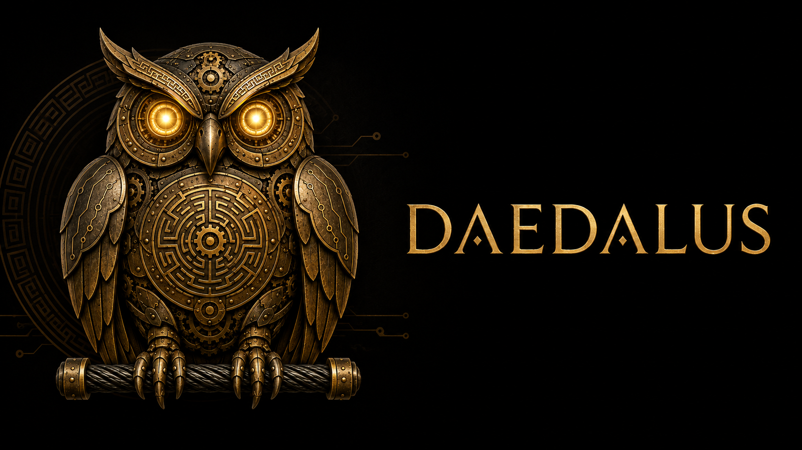

<p align="center">
  
</p>

# daedalus

A unified Allen-Bradley / EtherNet-IP library for Python, built on a **sans-I/O protocol core**.

> **Status:** Pre-implementation. This repository currently holds the architecture
> spec ([`eip-library-master-plan.md`](eip-library-master-plan.md)). Code lands phase
> by phase per the roadmap below.

## What it is

`daedalus` ports the protocol cores of [`pycomm3`](https://github.com/ottowayi/pycomm3)
(MIT, unmaintained) and [`pylogix`](https://github.com/dmroeder/pylogix) (Apache-2.0)
into a fresh, layered codebase, then adds the capabilities neither library has:
asyncio, Class 1 implicit I/O, a deterministic scheduler, a write-safety policy gate,
typed codegen with L5X reconciliation, and modern packaging.

The defining design rule: **the wire codec, session, and drivers (layers L0–L3) never
touch a socket.** Transports are pluggable shells around one codec, so sync, asyncio,
and Class 1 are *additions* to a single protocol stack rather than parallel forks.

## Safety posture

`daedalus` is **read-only unless explicitly armed.** Every write passes through a
policy gate (read-only mode, allow/denylist, dry-run, critic hook) with read-back
verify and an immutable audit log. It will never perform online program edits,
firmware flashing, program download, or keyswitch changes, and treats GuardLogix
safety tags as read-only.

## Roadmap

| Phase | Deliverable |
|---|---|
| 0 | Scaffold — repo, packaging, CI, license/NOTICE |
| 1 | Codec — sans-I/O wire layer (types, services, status, packets, segments) |
| 2 | Sync parity — transport + session + `LogixDriver` (parity vs pycomm3) |
| 3 | Async — asyncio transport + `AsyncLogixDriver` on the same codec |
| 4 | Runtime — scheduler, change-of-state, write-safety gate |
| 5 | PCCC / PLC-5 — `SLCDriver` → `PLC5Driver` (EtherNet/IP PCCC + CSP) |
| 6 | Class 1 — implicit cyclic I/O (UDP, RPI, run/idle, sequence) |
| 7 | Typed / L5X — codegen + online↔offline reconciliation |
| 8 | Hardening — observability, resilience, MicroPython slim build |
| 9 | Integrations — digital-twin bridge, NEXUS/TALOS adapters |

See the [master plan](eip-library-master-plan.md) for the full architecture, locked
decisions, and testing strategy.

## License

Apache-2.0. See [`LICENSE`](LICENSE) and [`NOTICE`](NOTICE) (preserves the pycomm3 MIT
and pylogix Apache-2.0 attributions).

## Development

**Prerequisites:** [uv](https://docs.astral.sh/uv/)

```bash
# Install all dependencies (base + typed + oracle extras + dev tools)
uv sync --extra typed --extra oracle

# Install pre-commit hooks
uv run pre-commit install

# Run tests
uv run pytest

# Lint
uv run ruff check .

# Format check
uv run ruff format --check .

# Type check
uv run mypy
```
